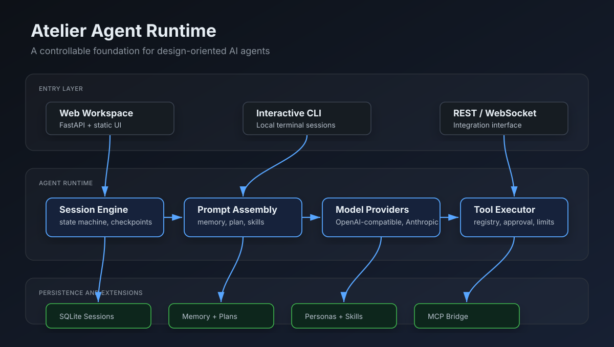
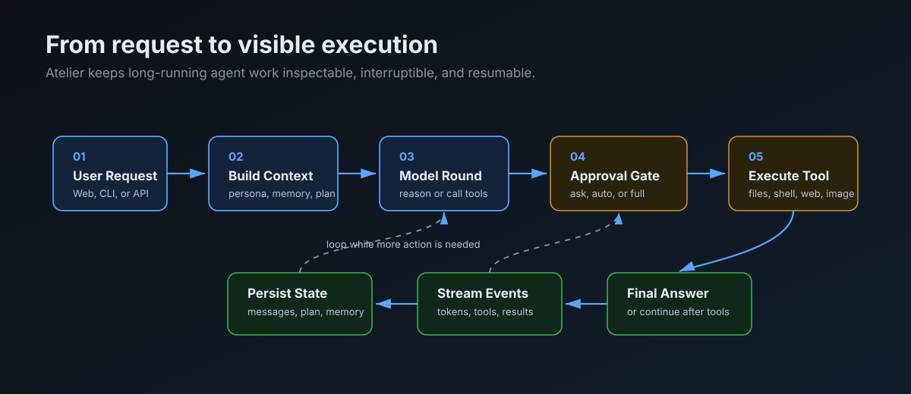

# Atelier

Atelier 是一个面向专业设计智能体的轻量级 Agent Harness。它不是单纯的聊天页面，而是一套可观察、可审批、可持久化、可扩展的智能体运行底座：智能体可以在同一个会话中理解需求、规划任务、调用工具、保存上下文、请求人工确认、生成子智能体，并通过 WebSocket 把执行过程实时呈现给用户。

当前版本聚焦通用运行时能力，适合作为设计智能体、研究型工作台、自动化开发助手或多智能体协作系统的基础工程。



## 核心亮点

- **双入口体验**：提供浏览器 Web Workspace、交互式 CLI，以及 REST / WebSocket API。
- **长任务智能体运行时**：采用 ReAct 风格循环，支持多轮模型调用、工具执行、状态恢复和中途取消。
- **多模型 Provider**：支持 OpenAI-compatible 接口和 Anthropic 风格接口，模型、Base URL 和密钥都通过配置注入。
- **工具系统**：内置文件读写、搜索、Shell / PowerShell、网页搜索、网页抓取、图片生成/编辑、计划、记忆、后台任务和子智能体。
- **会话持久化**：使用 SQLite 保存消息、会话元数据、计划、记忆、checkpoint、父子会话关系。
- **审批与权限**：对高风险工具提供 `ask`、`auto`、`full` 三类审批模式，并支持 persona 级工具白名单。
- **Skills / Personas / Commands**：把角色设定、可复用流程和项目命令沉淀到 `.myharness/`，让智能体行为可管理、可复用。
- **上下文管理**：支持 prompt cache 与自动压缩，让长会话在上下文接近上限时继续运行。
- **多智能体协作**：父会话可创建子智能体会话，适合拆分调研、规划、实现、评审和文档等角色。
- **运行过程可视化**：前端可实时显示模型轮次、工具调用、工具结果、计划变化、审批请求和恢复事件。

## 适用场景

Atelier 适合下列产品或研究方向：

- 构建设计调研、视觉产物生成、方案评审、原型迭代等专业设计智能体。
- 搭建可本地运行的 AI 工作台，让智能体在可控权限下读写项目文件。
- 研究多智能体协作、可恢复长任务、人工审批、上下文压缩等 Agent Runtime 能力。
- 将现有模型服务、MCP 服务或内部工具接入统一的 Agent 工具注册体系。
- 在 Web UI、CLI 和自定义前端之间复用同一套后端智能体能力。

## 产品架构

Atelier 可以分为五层：

| 层级 | 说明 |
| --- | --- |
| 入口层 | Web UI、CLI、REST API、WebSocket |
| 会话层 | session 创建、恢复、改名、置顶、归档、父子关系、运行状态 |
| 智能体运行层 | prompt 组装、模型调用、工具调用、审批、状态机、取消/恢复 |
| 扩展层 | tools、skills、personas、commands、MCP bridge |
| 存储层 | SQLite / memory backend、message store、plan store、memory store |

## 运行流程



一次典型任务会经过：

1. 用户从 Web、CLI 或 API 发送请求。
2. 引擎组装系统提示、persona、skill 描述、memory、plan 和历史消息。
3. 模型决定直接回复，或调用一个/多个工具。
4. 工具执行前按审批模式处理确认。
5. 工具结果写回会话，前端通过 WebSocket 实时接收事件。
6. 如果还需要继续推理，引擎进入下一轮；否则输出最终回复。

## 仓库结构

```text
.
|-- api/                    # FastAPI REST 和 WebSocket 服务
|-- harness/                # Agent runtime、工具、存储、模型 Provider
|   |-- engine/             # 主循环、状态机、压缩、prompt cache
|   |-- tools/              # 内置工具和工具执行层
|   |-- storage/            # SQLite / memory backend
|   |-- llm/                # Provider 抽象和实现
|   |-- mcp/                # MCP bridge 和 transports
|   `-- commands/           # 内置命令与项目命令系统
|-- static/                 # 浏览器前端
|-- .myharness/             # personas、skills、commands、transcripts
|-- tests/                  # 单元测试和集成测试
|-- cli.py                  # 交互式 CLI 入口
|-- config.yaml             # 运行时配置
|-- pyproject.toml          # Python 包配置
`-- README.md
```

## 环境要求

- Python 3.11 或更新版本
- 一个可用的模型服务：
  - OpenAI-compatible Chat Completions API
  - 或 Anthropic-compatible Provider
- 可选：Serper / Brave Search API Key，用于真实网页搜索
- 可选：图片生成/编辑接口，用于 `image_generate` 与 `image_edit`

## 快速开始

### 1. 安装依赖

```bash
pip install -e ".[dev]"
```

### 2. 配置环境变量

从示例文件创建本地配置：

```bash
cp .env.example .env
```

根据你的模型服务填写 `.env`。默认 OpenAI-compatible 通路示例：

```env
OPENAI_HUB_API_KEY=your-api-key
OPENAI_HUB_BASE_URL=https://your-openai-compatible-endpoint/v1
OPENAI_HUB_MODEL=gpt-4o
HARNESS_DEFAULT_PROVIDER=openai-hub
```

如果需要网页搜索：

```env
SERPER_API_KEY=your-serper-key
BRAVE_SEARCH_API_KEY=your-brave-key
```

如果需要设计图片生成与编辑：

```env
DESIGN_IMAGE_API_KEY=your-image-api-key
DESIGN_IMAGE_BASE_URL=https://your-image-endpoint/v1
DESIGN_IMAGE_MODEL=gpt-image-2
DESIGN_IMAGE_ENDPOINT=https://your-image-endpoint/v1/images/generations
DESIGN_IMAGE_EDIT_ENDPOINT=https://your-image-endpoint/v1/images/edits
DESIGN_IMAGE_DEFAULT_SIZE=1024x1024
```

### 3. 启动 Web Workspace

```bash
uvicorn api.rest:app --port 8000
```

浏览器打开：

```text
http://localhost:8000
```

长任务或会写文件的智能体任务不建议使用 `--reload`，因为文件变化可能触发服务重启，导致当前运行被打断。

### 4. 使用 CLI

```bash
python cli.py
python cli.py --persona builder
python cli.py --provider openai-hub
python cli.py --question-mode question
```

CLI 中常用命令：

| 命令 | 说明 |
| --- | --- |
| `/exit` 或 `/quit` | 退出 |
| `/reset` | 开启新会话 |
| `/tools` | 查看当前可用工具 |
| `/skills` | 查看可用 skills |
| `/personas` | 查看可用 personas |
| `/state` | 查看当前引擎状态 |
| `/<skill-name>` | 手动触发某个 skill |

## 配置说明

核心配置位于 `config.yaml`。

| 配置项 | 说明 |
| --- | --- |
| `default_provider` | 新会话默认模型 Provider |
| `providers` | OpenAI-compatible / Anthropic Provider 定义 |
| `engine.max_rounds` | 单次任务最多模型循环轮数 |
| `compression` | 上下文窗口、触发比例、保留消息数和摘要 Provider |
| `storage` | `sqlite` 或 `memory` 存储后端 |
| `tools.enabled` | 全局启用工具列表 |
| `tools.confirm_tools` | 需要人工确认的工具 |
| `tools.limits` | 单个工具输出和执行限制 |
| `mcp_servers` | 可选 MCP 服务配置 |

`config.yaml` 支持环境变量展开，API Key 等敏感信息应放在 `.env`，不要提交到仓库。

## 内置工具

| 工具 | 用途 |
| --- | --- |
| `read_file`, `write_file`, `edit_file`, `create_directory`, `list_dir` | 文件系统操作 |
| `write_json` | 写入结构化 JSON |
| `search`, `grep`, `glob` | 代码和文本检索 |
| `shell`, `powershell` | 本地命令执行 |
| `web_search`, `web_fetch` | 网页搜索与网页正文抓取 |
| `image_generate`, `image_edit` | 设计图片生成与编辑 |
| `todo_write` | 创建和更新可见计划 |
| `memory` | 持久化记忆读写 |
| `think` | 显式推理记录，便于前端展示执行轨迹 |
| `background_task` | 后台长任务 |
| `spawn_agent`, `spawn_agents` | 创建子智能体 |
| `use_skill` | 按需加载完整 skill 内容 |

## Personas、Skills 与 Commands

项目本地行为配置集中在 `.myharness/`：

```text
.myharness/
|-- personas/       # 智能体角色，如 builder、planner、reviewer
|-- skills/         # 可复用流程知识，每个 skill 包含 SKILL.md
|-- commands/       # 项目命令
`-- transcripts/    # 运行过程记录
```

### Persona

Persona 定义智能体身份、系统提示词、默认 Provider、审批模式和可用工具。适合沉淀不同工作角色，例如：

- `builder`：偏实现和交付
- `planner`：偏拆解和计划
- `reviewer`：偏审查和风险识别
- `researcher`：偏资料收集和总结
- `docs-writer`：偏文档编写

### Skill

Skill 是可复用的流程知识。系统启动后会把 skill 的名称和描述注入 prompt；完整内容只有当智能体调用 `use_skill` 时才加载。这能让 prompt 保持轻量，同时保留复杂流程的可调用能力。

### Command

Command 用于定义项目级快捷动作。它们可以被 CLI 或 Web UI 暴露出来，用于复用常见任务模板。

## Web UI 能力

Web Workspace 通过 FastAPI 后端和 WebSocket 事件工作，主要支持：

- 创建、恢复、切换、重命名、置顶、归档和删除会话。
- 选择 Provider、Persona、审批模式和提问模式。
- 实时查看消息、工具调用、工具结果、状态变化和运行错误。
- 展开工具调用详情，观察智能体实际做了什么。
- 编辑历史用户消息并从该位置重新生成。
- 查看和编辑项目 skills、personas 与运行配置。

## 提问模式

Atelier 支持两种会话模式：

| 模式 | 行为 | 适合场景 |
| --- | --- | --- |
| `noquestion` | 默认直接执行，必要时在最终回复中说明假设 | 需求清晰、希望快速完成 |
| `question` | 允许智能体在关键信息缺失时主动提问 | 复杂任务、设计目标不明确、需要减少偏差 |

CLI 示例：

```bash
python cli.py --persona builder --question-mode question
```

REST 切换示例：

```bash
curl -X PATCH http://localhost:8000/sessions/{session_id}/mode \
  -H "Content-Type: application/json" \
  -d '{"question_mode": "question"}'
```

## REST 与 WebSocket API

常用 REST 端点：

| Endpoint | 用途 |
| --- | --- |
| `POST /sessions` | 创建或恢复会话 |
| `GET /sessions` | 获取会话列表 |
| `GET /sessions/{id}/state` | 获取完整会话快照 |
| `POST /sessions/{id}/messages` | 发送用户消息 |
| `PATCH /sessions/{id}/messages/{message_id}` | 编辑历史消息，可选择重新生成 |
| `POST /sessions/{id}/continue` | 从可恢复状态继续 |
| `POST /sessions/{id}/cancel` | 取消运行中任务 |
| `POST /sessions/{id}/confirm` | 确认待审批工具调用 |
| `POST /sessions/{id}/deny` | 拒绝待审批工具调用 |
| `PATCH /sessions/{id}/approval-mode` | 切换审批模式 |
| `PATCH /sessions/{id}/mode` | 切换提问模式 |
| `GET /config/agents` | 列出 Agent profiles |
| `GET /memory` / `POST /memory` | 管理记忆 |
| `GET /commands` | 列出项目命令 |
| `WS /ws/{session_id}` | 推送运行时事件 |

WebSocket 会推送 token、message、state、tool result、question asked/resolved 等事件，前端应以服务端状态为准。

## 安全与权限

Atelier 是本地研究型 Agent Harness，已经提供基础安全边界，但发布或接入真实用户前仍需审查配置。

已提供的控制：

- Shell / PowerShell 等高风险工具可强制人工确认。
- 每个 Persona 可限制可用工具。
- 工具输出有长度上限，降低上下文爆炸风险。
- 私密配置通过环境变量注入，避免写入源码。
- Web fetch 工具包含基础 SSRF 防护。
- 状态机管理运行、等待审批、等待提问、取消和错误状态。

上线前建议：

- 使用最小工具权限配置 persona。
- 禁用不需要的 shell 类工具。
- 将服务部署在受控网络内。
- 对外部用户增加鉴权、配额和审计日志。
- 定期检查 `.env`、数据库文件和生成产物目录的访问权限。

## 开发与测试

运行全部测试：

```bash
pytest
```

常用定向测试：

```bash
pytest tests/test_engine.py
pytest tests/test_tools.py
pytest tests/test_storage.py
pytest tests/test_streaming.py
pytest tests/test_question_mode.py
```

统计代码量：

```bash
python scripts/loc.py
```

## 发布检查清单

- [ ] `.env.example` 已覆盖必需配置项，真实 `.env` 未提交。
- [ ] `config.yaml` 默认 Provider 与示例环境变量一致。
- [ ] `tools.confirm_tools` 包含高风险工具。
- [ ] Web UI 可通过 `uvicorn api.rest:app --port 8000` 正常访问。
- [ ] CLI 可通过 `python cli.py --persona builder` 正常启动。
- [ ] 核心测试通过。
- [ ] README 中的图片、命令和接口说明与当前代码一致。
- [ ] License 文件存在且符合发布要求。

## 路线图

- 设计领域专用工具：素材收集、视觉分析、版式评审、品牌规范生成。
- 更完整的产物工作流：设计 brief、方案批次、评审记录、最终导出包。
- 更细粒度权限系统：按目录、工具、Provider 和会话限制能力。
- 更完善的 Web UI：运行轨迹、文件预览、产物画廊、子智能体视图。
- 更强的记忆管理：项目级偏好、长期约束、可编辑 memory。
- 生产化部署：鉴权、多用户隔离、队列、日志审计和监控。

## 常见问题

**Q: 启动后提示 Provider 不存在？**

检查 `config.yaml` 的 `providers` 名称，以及 `.env` 中 `HARNESS_DEFAULT_PROVIDER` 是否指向同一个名称。

**Q: Web 搜索没有结果？**

如果未配置 `SERPER_API_KEY` 或 `BRAVE_SEARCH_API_KEY`，`web_search` 只能使用能力有限的 DuckDuckGo instant-answer fallback。真实搜索建议配置 Serper 或 Brave。

**Q: 为什么不建议 `uvicorn --reload`？**

智能体执行任务时可能会写文件，`--reload` 会监听文件变化并重启服务，从而中断当前会话。

**Q: Skill 没有自动触发怎么办？**

检查 `.myharness/skills/<skill-name>/SKILL.md` 的 description 是否明确描述触发场景；也可以用 `/<skill-name>` 手动触发。

**Q: 如何让智能体更安全？**

在 persona 中设置 `allowed_tools`，并在 `config.yaml` 中禁用不必要工具。对 shell 类工具保持确认模式。

## 项目状态

Atelier 当前是持续迭代中的研究型产品底座。通用智能体运行时、工具系统、会话存储、Web/CLI 入口和多智能体基础能力已经具备；面向专业设计生产的领域工具、产物管理、权限加固和生产部署能力仍在推进。

## License

Atelier 使用 [MIT License](LICENSE) 开源。
