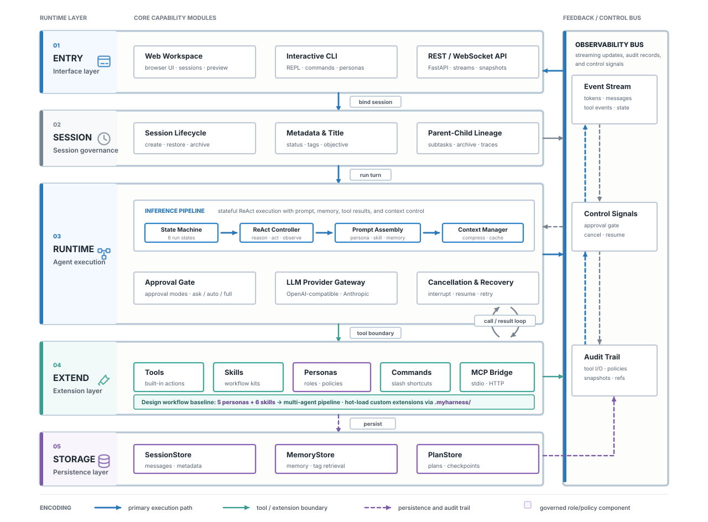

# Atelier

[English](README.md) | [简体中文](README.zh-CN.md)

Atelier is a lightweight agent harness for building professional, design-oriented AI agents. It is not a thin chat wrapper around a model API. It is a controllable runtime foundation where agents can understand a request, plan work, call tools, persist context, request human approval, spawn sub-agents, and stream the execution process back to the user in real time.

The current release focuses on the general-purpose runtime layer. It is suitable as the foundation for design agents, research workspaces, local automation assistants, and multi-agent systems that need predictable execution, tool governance, persistent sessions, and observable long-running work.



## Highlights

- **Web, CLI, and API entry points**: use the browser workspace, run an interactive local CLI, or integrate through REST and WebSocket APIs.
- **Long-running agent runtime**: a ReAct-style loop supports multiple model rounds, tool execution, cancellation, recovery, and final response generation.
- **Provider abstraction**: OpenAI-compatible and Anthropic-style providers can be configured through `config.yaml` and environment variables.
- **Extensible tool system**: built-in tools cover file operations, search, shell and PowerShell, web search, web fetch, image generation/editing, planning, memory, background tasks, and sub-agent creation.
- **Persistent sessions**: SQLite-backed storage keeps messages, metadata, plans, memory entries, checkpoints, and parent-child session relationships.
- **Approval and permission controls**: high-risk tools can require user approval, and personas can restrict the tools available to a session.
- **Personas, skills, and commands**: reusable roles, procedures, and project commands are loaded from `.myharness/`.
- **Context management**: prompt caching and automatic compression help long sessions continue as context grows.
- **Multi-agent collaboration**: parent sessions can spawn sub-agents for research, planning, implementation, review, documentation, or other specialized roles.
- **Runtime observability**: the frontend can display model rounds, tool calls, tool results, plan changes, approval prompts, recovery events, and streamed state updates.

## Use Cases

Atelier is designed for teams and researchers who need more than a single-turn assistant:

- Build agents for design research, visual production, critique, prototyping, and artifact-oriented workflows.
- Run local AI workspaces where agents can read and edit project files under controlled permissions.
- Explore multi-agent collaboration, interruptible execution, human approval, context compression, and resumable tasks.
- Integrate existing model gateways, MCP servers, internal tools, or design-specific services into one tool registry.
- Reuse the same backend runtime across a web workspace, CLI, and custom product interfaces.

## Architecture

Atelier is organized into five runtime layers:

| Layer | Responsibility |
| --- | --- |
| Entry layer | Web UI, CLI, REST API, WebSocket streaming |
| Session layer | Session creation, restore, rename, pin/archive, parent-child relationships, runtime state |
| Agent runtime layer | Prompt assembly, model calls, tool calls, approval gates, state machine, cancellation and recovery |
| Extension layer | Tools, skills, personas, commands, MCP bridge |
| Storage layer | SQLite or in-memory backends for messages, plans, memory, and session metadata |

## Repository Layout

```text
.
|-- api/                    # FastAPI REST and WebSocket server
|-- harness/                # Agent runtime, tools, storage, LLM providers
|   |-- engine/             # Main loop, state machine, compression, prompt cache
|   |-- tools/              # Built-in tools and execution layer
|   |-- storage/            # SQLite and in-memory backends
|   |-- llm/                # Provider abstraction and implementations
|   |-- mcp/                # MCP bridge and transports
|   `-- commands/           # Built-in and project command system
|-- static/                 # Browser frontend
|-- .myharness/             # Personas, skills, commands, transcripts
|-- tests/                  # Unit and integration tests
|-- cli.py                  # Interactive CLI entry point
|-- config.yaml             # Runtime configuration
|-- pyproject.toml          # Python package metadata
`-- README.md
```

## Requirements

- Python 3.11 or newer
- A model provider:
  - OpenAI-compatible Chat Completions API, or
  - Anthropic-compatible provider
- Optional: Serper or Brave Search API key for full web search
- Optional: image generation/editing endpoint for `image_generate` and `image_edit`

## Quick Start

### 1. Install dependencies

```bash
pip install -e ".[dev]"
```

### 2. Configure environment variables

Create a local environment file:

```bash
cp .env.example .env
```

Fill in the provider credentials you want to use. Example for the default OpenAI-compatible route:

```env
OPENAI_HUB_API_KEY=your-api-key
OPENAI_HUB_BASE_URL=https://your-openai-compatible-endpoint/v1
OPENAI_HUB_MODEL=gpt-4o
HARNESS_DEFAULT_PROVIDER=openai-hub
```

For full web search:

```env
SERPER_API_KEY=your-serper-key
BRAVE_SEARCH_API_KEY=your-brave-key
```

For image generation and editing:

```env
DESIGN_IMAGE_API_KEY=your-image-api-key
DESIGN_IMAGE_BASE_URL=https://your-image-endpoint/v1
DESIGN_IMAGE_MODEL=gpt-image-2
DESIGN_IMAGE_ENDPOINT=https://your-image-endpoint/v1/images/generations
DESIGN_IMAGE_EDIT_ENDPOINT=https://your-image-endpoint/v1/images/edits
DESIGN_IMAGE_DEFAULT_SIZE=1024x1024
```

### 3. Start the Web Workspace

```bash
uvicorn api.rest:app --port 8000
```

Open:

```text
http://localhost:8000
```

Avoid `--reload` for long-running or file-writing agent tasks. File changes can restart the server and interrupt the active session.

### 4. Use the CLI

```bash
python cli.py
python cli.py --persona builder
python cli.py --provider openai-hub
python cli.py --question-mode question
```

Common CLI commands:

| Command | Description |
| --- | --- |
| `/exit` or `/quit` | Exit the CLI |
| `/reset` | Start a new session |
| `/tools` | List tools available in the current session |
| `/skills` | List available skills |
| `/personas` | List available personas |
| `/state` | Show the current engine state |
| `/<skill-name>` | Manually invoke a skill |

## Configuration

The main runtime configuration is stored in `config.yaml`.

| Setting | Description |
| --- | --- |
| `default_provider` | Default model provider for new sessions |
| `providers` | OpenAI-compatible and Anthropic-style provider definitions |
| `engine.max_rounds` | Maximum number of model/tool loop rounds for one task |
| `compression` | Context window, trigger ratio, recent-message retention, and summary provider |
| `storage` | SQLite or in-memory backend |
| `tools.enabled` | Globally enabled tool list |
| `tools.confirm_tools` | Tools that require human confirmation |
| `tools.limits` | Per-tool output and execution limits |
| `mcp_servers` | Optional MCP server definitions |

`config.yaml` supports environment-variable expansion. Keep API keys and secrets in `.env`, not in source control.

## Built-in Tools

| Tool | Purpose |
| --- | --- |
| `read_file`, `write_file`, `edit_file`, `create_directory`, `list_dir` | File-system operations |
| `write_json` | Structured JSON writing |
| `search`, `grep`, `glob` | Code and text search |
| `shell`, `powershell` | Local command execution |
| `web_search`, `web_fetch` | Web search and web page extraction |
| `image_generate`, `image_edit` | Design image generation and editing |
| `todo_write` | Visible plan creation and updates |
| `memory` | Persistent memory read/write |
| `think` | Explicit reasoning notes for runtime traces |
| `background_task` | Long-running background work |
| `spawn_agent`, `spawn_agents` | Sub-agent creation |
| `use_skill` | Load full skill instructions on demand |

## Personas, Skills, and Commands

Project-local behavior is configured under `.myharness/`:

```text
.myharness/
|-- personas/       # Agent roles such as builder, planner, reviewer
|-- skills/         # Reusable procedural knowledge; each skill has SKILL.md
|-- commands/       # Project commands
`-- transcripts/    # Runtime transcripts
```

### Personas

A persona defines an agent's role, system prompt, default provider, approval mode, and allowed tools. Typical roles include:

- `builder`: implementation and delivery
- `planner`: decomposition and task planning
- `reviewer`: quality review and risk identification
- `researcher`: source gathering and synthesis
- `docs-writer`: documentation writing

### Skills

Skills capture reusable procedures. At session startup, the engine injects skill names and descriptions into the prompt. Full skill content is loaded only when the agent calls `use_skill`, keeping the prompt compact while still enabling specialized workflows.

### Commands

Commands define project-level shortcuts for repeatable tasks. They can be exposed through the CLI or Web UI and reused as task templates.

## Web UI Capabilities

The Web Workspace is backed by FastAPI and WebSocket events. It supports:

- Creating, restoring, switching, renaming, pinning, archiving, and deleting sessions.
- Selecting provider, persona, approval mode, and question mode.
- Viewing messages, tool calls, tool results, state changes, and runtime errors in real time.
- Expanding tool-call details to inspect what the agent actually did.
- Editing a historical user message and regenerating from that point.
- Viewing and editing project skills, personas, and runtime configuration.

## Question Mode

Atelier supports two session-level question modes:

| Mode | Behavior | Best for |
| --- | --- | --- |
| `noquestion` | Execute directly by default and state key assumptions in the final response when needed | Clear tasks where speed matters |
| `question` | Allow the agent to ask structured clarification questions when critical information is missing | Complex work, ambiguous design goals, or high-cost decisions |

CLI example:

```bash
python cli.py --persona builder --question-mode question
```

REST example:

```bash
curl -X PATCH http://localhost:8000/sessions/{session_id}/mode \
  -H "Content-Type: application/json" \
  -d '{"question_mode": "question"}'
```

## REST and WebSocket API

Common REST endpoints:

| Endpoint | Purpose |
| --- | --- |
| `POST /sessions` | Create or restore a session |
| `GET /sessions` | List sessions |
| `GET /sessions/{id}/state` | Get a complete session snapshot |
| `POST /sessions/{id}/messages` | Send a user message |
| `PATCH /sessions/{id}/messages/{message_id}` | Edit a historical message; optionally regenerate |
| `POST /sessions/{id}/continue` | Continue from a recoverable state |
| `POST /sessions/{id}/cancel` | Cancel a running task |
| `POST /sessions/{id}/confirm` | Confirm a pending tool call |
| `POST /sessions/{id}/deny` | Deny a pending tool call |
| `PATCH /sessions/{id}/approval-mode` | Change approval mode |
| `PATCH /sessions/{id}/mode` | Change question mode |
| `GET /config/agents` | List agent profiles |
| `GET /memory` / `POST /memory` | Manage memory entries |
| `GET /commands` | List project commands |
| `WS /ws/{session_id}` | Stream runtime events |

WebSocket events include tokens, messages, state snapshots, tool results, and question asked/resolved events. Frontends should treat the backend as the source of truth.

## Security and Permissions

Atelier is a local research harness. It includes practical safety controls, but production or multi-user deployment requires additional review.

Built-in controls include:

- High-risk tools such as Shell and PowerShell can require human confirmation.
- Personas can restrict the tools available to a session.
- Tool outputs are capped to reduce context-overflow risk.
- Secrets are injected through environment variables.
- The web-fetch tool includes basic SSRF protection.
- Runtime state transitions are controlled by an explicit state machine.

Before exposing Atelier to untrusted users:

- Use least-privilege personas.
- Disable shell-like tools when they are not required.
- Run the service inside a controlled network.
- Add authentication, rate limits, and audit logging.
- Review access permissions for `.env`, the SQLite database, and generated artifact directories.

## Development and Testing

Run the full test suite:

```bash
pytest
```

Useful focused tests:

```bash
pytest tests/test_engine.py
pytest tests/test_tools.py
pytest tests/test_storage.py
pytest tests/test_streaming.py
pytest tests/test_question_mode.py
```

Count lines of code:

```bash
python scripts/loc.py
```

## Release Checklist

- [ ] `.env.example` covers required configuration; real `.env` is not committed.
- [ ] `config.yaml` default provider matches the documented environment variables.
- [ ] High-risk tools are listed in `tools.confirm_tools`.
- [ ] The Web UI starts with `uvicorn api.rest:app --port 8000`.
- [ ] The CLI starts with `python cli.py --persona builder`.
- [ ] Core tests pass.
- [ ] README image links, commands, and endpoint descriptions match the current code.
- [ ] The license file is present and appropriate for release.

## Roadmap

- Design-domain tools for asset research, visual analysis, layout critique, and brand-system generation.
- Richer artifact workflows for briefs, design batches, critique records, and final export packages.
- More granular permissions by directory, tool, provider, and session.
- A more capable Web UI with runtime traces, file previews, artifact galleries, and sub-agent views.
- Better memory management for project preferences, long-term constraints, and editable memory.
- Production deployment support: authentication, multi-user isolation, queues, audit logs, and monitoring.

## FAQ

**Why does startup report that a provider does not exist?**

Check the provider names in `config.yaml` and make sure `.env` points `HARNESS_DEFAULT_PROVIDER` to one of those names.

**Why does web search return no useful results?**

Without `SERPER_API_KEY` or `BRAVE_SEARCH_API_KEY`, `web_search` falls back to a limited DuckDuckGo instant-answer mode. Configure Serper or Brave for full web search.

**Why should I avoid `uvicorn --reload`?**

Agents may write files during a task. `--reload` watches file changes and can restart the server, interrupting the active session.

**What should I do if a skill is not invoked automatically?**

Check whether `.myharness/skills/<skill-name>/SKILL.md` has a clear description of when the skill should be used. You can also invoke it manually with `/<skill-name>`.

**How can I make an agent session safer?**

Set `allowed_tools` in the persona and disable unnecessary tools in `config.yaml`. Keep shell-like tools behind approval.

## Project Status

Atelier is an evolving research-oriented product foundation. The general agent runtime, tool system, persistent sessions, Web/CLI entry points, and basic multi-agent capabilities are implemented. Design-domain tooling, artifact management, permission hardening, and production deployment are still under active development.

## License

Atelier is released under the [MIT License](LICENSE).
